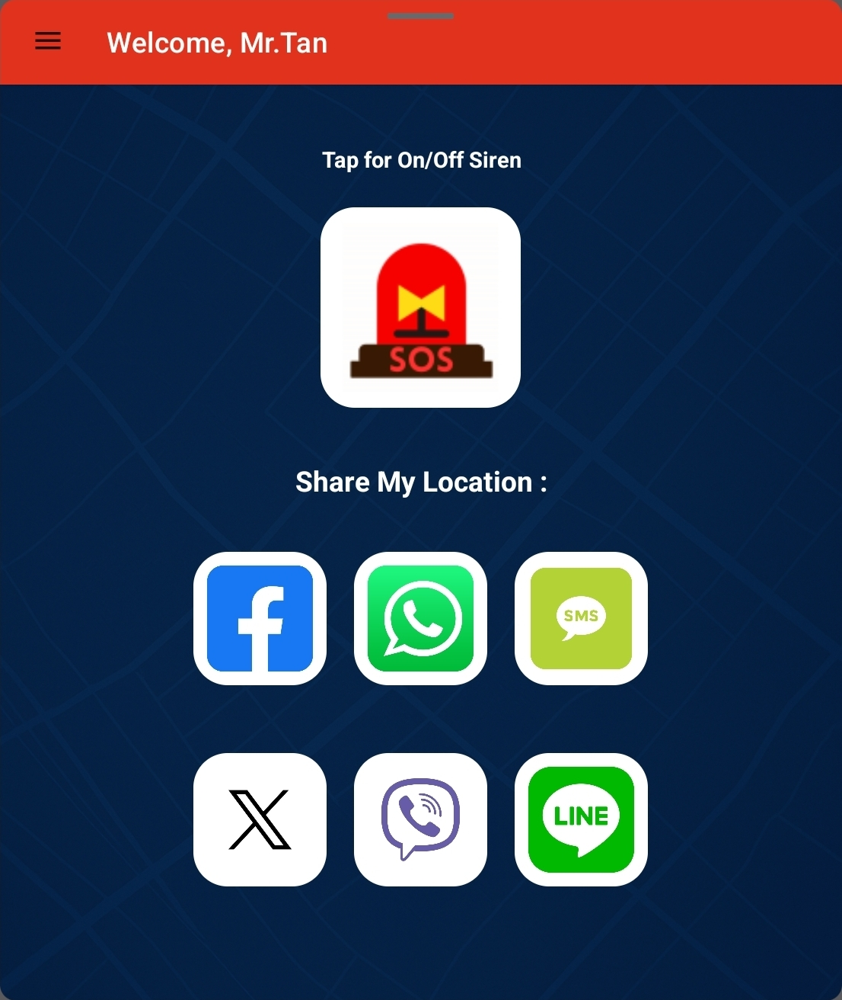
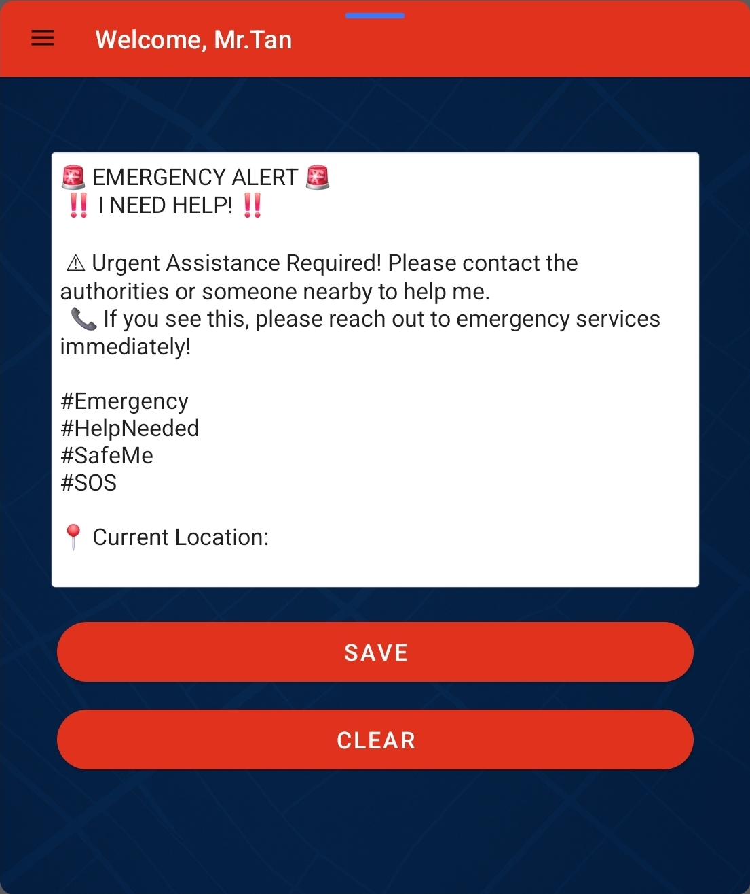
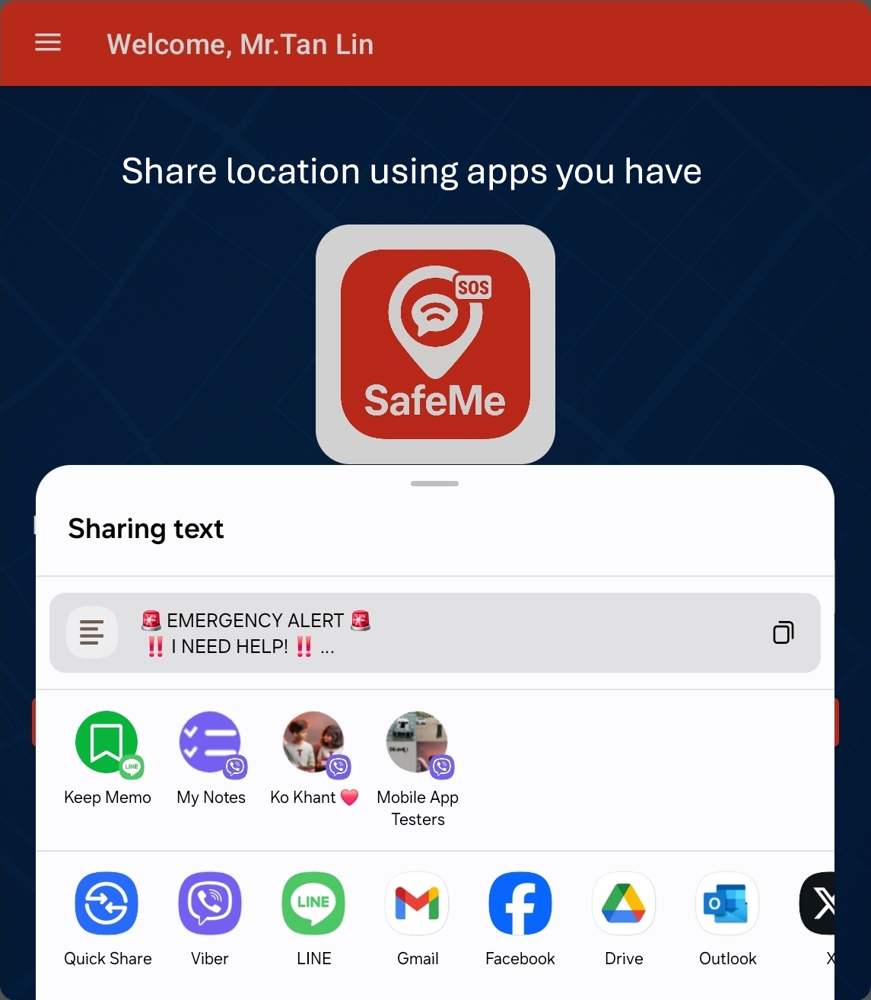
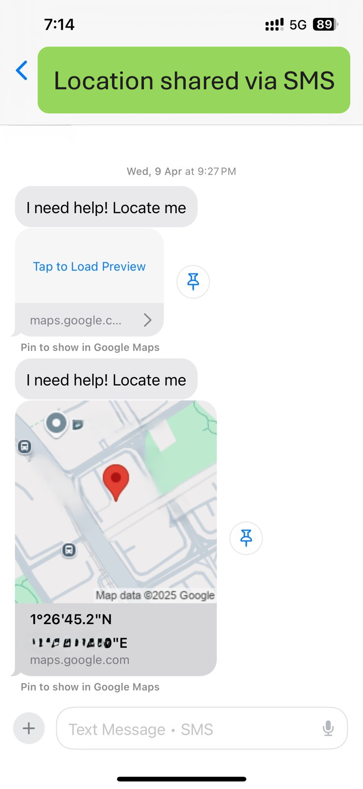
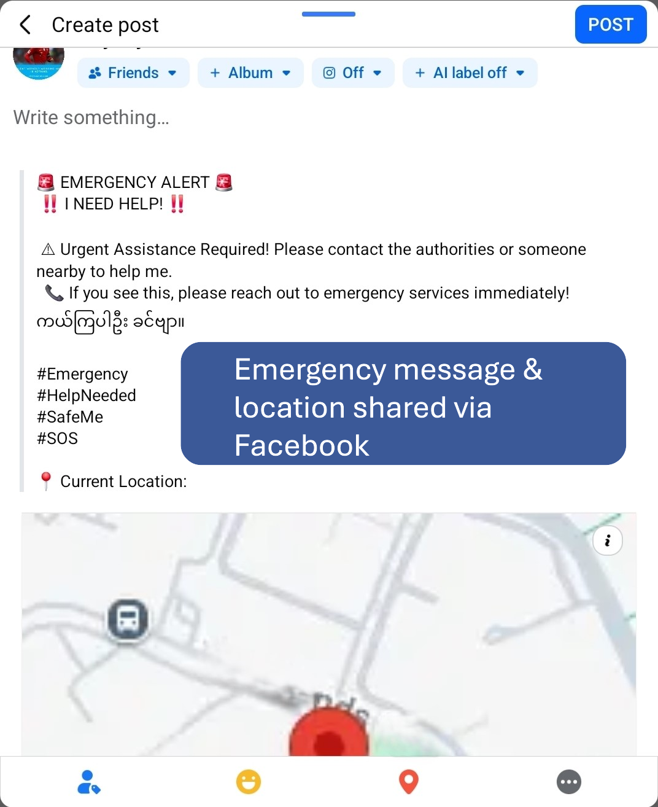
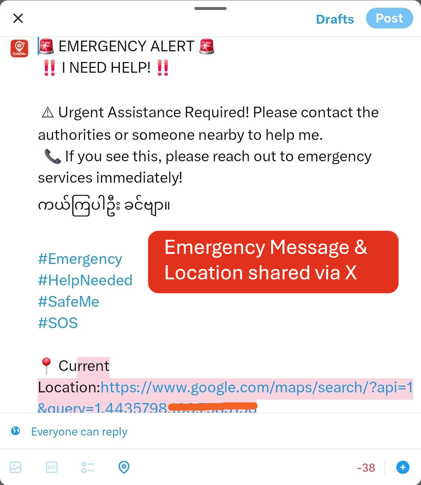

# 🚩 SafeMe - SOS & Loud Siren

> Be heard. Be found. Be safe.

SafeMe is a personal safety app designed to help users during emergencies, dangerous situations, or whenever they feel unsafe. With just one tap, users can instantly share their real-time location, alert trusted contacts, and activate a loud emergency siren.

---

# About the App

Whether you're walking alone at night, commuting, traveling, or facing an emergency, SafeMe helps you stay connected and protected by making help accessible instantly.

SafeMe is built to provide fast emergency communication and safety tools when they matter most.

🌐 **Website for more features and app screenshots:**  
https://safemeapp.pages.dev/

📥 **Download on Google Play Store**  
[_Add your Play Store link here_](https://play.google.com/store/apps/details?id=com.zawlin.safeme)

---

# Features

## 📍 Real-time Location Sharing
Instantly share your live location with trusted contacts through apps like WhatsApp, Facebook Messenger, Viber, SMS, and more.

## 🆘 Emergency SOS Alerts
Send emergency alerts together with a personalized message to quickly notify family and friends.

## 📞 Emergency Contacts
Add trusted contacts and notify them instantly during emergencies.

## 💬 SMS Emergency Alerts
Send your current location directly through SMS for urgent situations where internet access may not be available.

## 📣 Loud Siren
Activate a loud emergency siren to attract attention from nearby people and increase your personal safety.

## 📋 Activity Logs
Track and review previous emergency alerts and activities.

## 🌍 Earthquake Information
Receive live earthquake updates and voice notifications to stay informed during disasters.

---

# Who Is SafeMe For?

SafeMe is designed for everyone, including:

- Solo travelers
- Women
- Students
- Seniors
- Night-shift workers
- Disaster survivors
- Daily commuters
- Anyone looking for a reliable personal safety app

---

# Why Choose SafeMe?

✅ Simple and easy to use  
✅ Fast emergency response tools  
✅ Real-time location sharing  
✅ Lightweight and reliable  
✅ No ads  
✅ Designed for real-life emergencies

---

# Privacy & Security

SafeMe respects user privacy. Location sharing and emergency alerts are only triggered by user action during emergency situations.

---

# Tech Stack

- Android (Java)
- GoogleLocation Services
- SMS & Notification APIs
- Firebase (Authentication & Backend Services)

---

# Screenshots


```markdown






```

---

# Installation

Clone the repository:

```bash
git clone [https://github.com/your-username/safeme-app.git](https://github.com/zawlinhtay-mm/SafeMe-MobileApp.git)
```

Open the project using Android Studio and run it on an emulator or Android device.

---

# 🤝 Contributing

Contributions are welcome.

---

# 📄 License

This project is licensed under the MIT License.

---

# ❤️ Stay Safe

SafeMe exists to help people feel safer and get help faster during emergencies.

Your safety is always one tap away.
